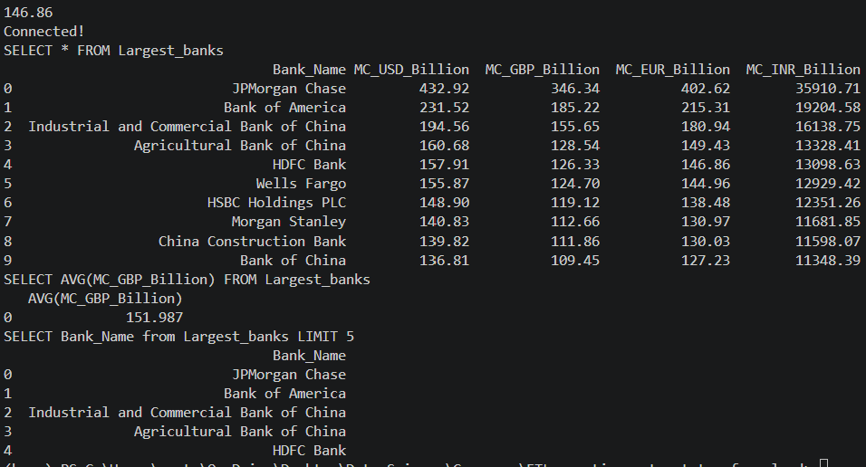
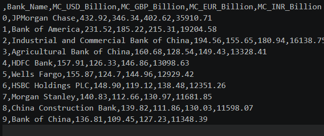

**Hands-on Lab: Acquiring and Processing Information on the World's Largest Banks**

**Estimated Time:** 60 mins

**Project Summary**
- **Description:** A small ETL project that extracts the top banks by market capitalization from a public webpage, transforms market-cap values into GBP, EUR, and INR using a provided exchange-rate CSV, and loads results to a CSV file and an SQLite database.
- **Goal:** Provide an automated script to produce the top-10 largest banks table every financial quarter.

**Prerequisites**
- Python 3.8+ installed.
- Install required packages:

```
python -m pip install requests bs4 pandas numpy lxml
```

**Data Sources**
- Web page (extraction target): archived Wikipedia page listing largest banks by market capitalization.
- Exchange rates CSV (used for conversions):
  - Remote URL: https://cf-courses-data.s3.us.cloud-object-storage.appdomain.cloud/IBMSkillsNetwork-PY0221EN-Coursera/labs/v2/exchange_rate.csv
  - Local copy (if present): [exchange_rate.csv](exchange_rate.csv)

**Files in this repository**
- [banks_project.py](banks_project.py) : Main ETL script implementing the functions below.
- [exchange_rate.csv](exchange_rate.csv) : Exchange rates used for currency conversion (if included).
- [Largest_banks_data.csv](Largest_banks_data.csv) : Output CSV produced by the script (if produced).
- [Banks.db](Banks.db) : SQLite database produced by the script (if produced).
- [code_log.txt](code_log.txt) : Execution log entries created by the script.

**Implemented Functions**
- `log_progress()` — Appends timestamped log messages to `code_log.txt`.
- `extract()` — Scrapes the "By market capitalization" table from the target webpage and returns a DataFrame with columns `Name` and `MC_USD_Billion`.
- `transform()` — Reads exchange rates from `exchange_rate.csv` and adds `MC_GBP_Billion`, `MC_EUR_Billion`, and `MC_INR_Billion` rounded to two decimals.
- `load_to_csv()` — Saves the transformed DataFrame to `Largest_banks_data.csv`.
- `load_to_db()` — Writes the DataFrame to an SQLite database file `Banks.db` in table `Largest_banks`.
- `run_queries()` — Runs verification queries against the `Largest_banks` table and prints results.

**How to run**
1. Ensure required packages are installed (see Prerequisites).
2. Ensure `exchange_rate.csv` is present in the project root. If not, download it with:

```
wget https://cf-courses-data.s3.us.cloud-object-storage.appdomain.cloud/IBMSkillsNetwork-PY0221EN-Coursera/labs/v2/exchange_rate.csv
```

1. Run the ETL script from the project root:

```
python banks_project.py
```

4. Outputs created:
- `Largest_banks_data.csv` — final CSV with columns `Bank_Name`, `MC_USD_Billion`, `MC_GBP_Billion`, `MC_EUR_Billion`, `MC_INR_Billion`.
- `Banks.db` — SQLite database containing table `Largest_banks`.
- `code_log.txt` — log of progress points (each stage appended with timestamp).

**Expected workflow**
- The script will call `log_progress()` at key points: start, after extraction, after transformation, after CSV save, after DB load, after queries, and on completion. Verify `code_log.txt` contents to ensure all stages ran.

**Troubleshooting**
- If web extraction fails, check network access and the URL. The page structure may change; inspect the HTML and update the selector used by `extract()`.
- If `exchange_rate.csv` is missing or malformed, the `transform()` step will fail — ensure the CSV has the expected columns (currency codes and rates).
- If the DB load fails, ensure you have write permissions in the project directory.

**Output screenshots**
- Place screenshots of the script outputs in the `images/` folder at the project root. Recommended filenames:
  - `images/output_table.png` — screenshot of the final table or CSV opened in a viewer.
  - `images/db_query.png` — screenshot showing an example database query result.

Example of how the screenshots will be displayed in this README:




**How to add screenshots**
- Create an `images/` directory in the project root (already created for you).
- Save your screenshots using the recommended filenames or update the image paths in this file if you choose different names.
- Commit the images to your repository so the README renders them when viewed.

**Notes**
- This README includes inline screenshots (no icons). If you prefer not to embed images, remove the image lines above.

